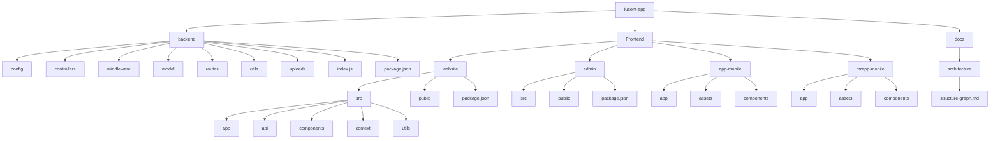

# Lucent App Structure Graph

This document provides a high-level file/folder graph for the workspace.

## Folder Tree (High Level)

```text
lucent-app/
|-- backend/
|   |-- config/
|   |-- controllers/
|   |-- middleware/
|   |-- model/
|   |-- routes/
|   |-- scripts/
|   |-- uploads/
|   |-- utils/
|   |-- index.js
|   |-- package.json
|   |-- SUPPORT_CHAT.md
|   `-- FIX-413-KYC.md
|
|-- Frontend/
|   |-- website/
|   |   |-- public/
|   |   |-- src/
|   |   |   |-- app/
|   |   |   |-- api/
|   |   |   |-- components/
|   |   |   |-- context/
|   |   |   |-- utils/
|   |   |   `-- config.js
|   |   |-- package.json
|   |   `-- README.md
|   |
|   |-- admin/
|   |   |-- public/
|   |   |-- src/
|   |   |-- package.json
|   |   `-- vite.config.js
|   |
|   |-- app/
|   |   |-- app/
|   |   |-- assets/
|   |   |-- components/
|   |   `-- package.json
|   |
|   `-- mrapp/
|       |-- app/
|       |-- assets/
|       |-- components/
|       `-- package.json
|
|-- docs/
|   `-- architecture/
|       `-- structure-graph.md
|
|-- README.md
`-- package.json
```

## Mermaid Graph



## Notes

- This is a high-level architecture map for quick navigation.
- If you want, this can be extended to include every nested file automatically from the current workspace state.
